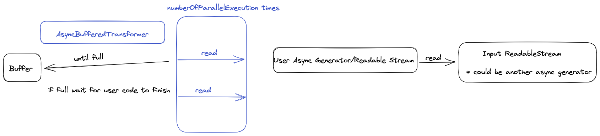

# Async Transformers


We find node.js [streams](https://nodejs.org/api/stream.html) are hard to use and implementing them correctly yourself adds a lot of boilerplate.

Once you have implemented a fully-compliant stream interface you will also find that actually executing parts of the streamed-processing-chain in parallel, e.g. io-bound tasks like network requests, is not supported out-of-the-box by node.js

Instead, [async generators](https://developer.mozilla.org/en-US/docs/Web/JavaScript/Reference/Global_Objects/AsyncGenerator) are a lot easier to reason about and write even when consuming native streams.

### Enter async-transformers

Async-Transformers is a tiny no-frills no-dependencies ts-first implementation of a buffered asynchronous generator.

* It will queue up numberOfParallelExecutions promises from a user-provided stream/generator up to the specified maximum number.



The method `asyncBufferedTransformer()` was inspired by [`rust futures buffered()`](https://docs.rs/futures/latest/futures/stream/trait.StreamExt.html#method.buffered).

## Usage

```typescript
import {asyncBufferedTransformer, drainStream, PromiseWrapper, collectAll} from '@uai/async-transformers';

type SomeStreamChunkToProcess = {};

async function* yourAsyncGenerator(inputStream: AsyncIterable<SomeStreamChunkToProcess>): AsyncIterable<PromiseWrapper<number>> {
    let i = 0;
    for await (const inputChunk of inputStream) {
        const nextOutput = i;
        yield {
            promise: new Promise((resolve) =>
                // do the expensive processing / io-requests, can of course also deal with an async function
                resolve(nextOutput)
            )
        }
        i++;
    }
}

const inputStream: AsyncIterable<SomeStreamChunkToProcess> = // some input stream

// must be >= 2 for the parallel execution to make sense.
const noOfParallelExecutions = 50;

//if you want to do more streamed processing of the output of your generator you can consume them directly
for await(const output of asyncBufferedTransformer(yourAsyncGenerator(inputStream), {
    noOfParallelExecutions
})) {
    //will log 0, 1, 2, 3 in order
    console.log(output);
}

//will resolve once all elements have been processed or reject the first time there is an error in any processed chunk
await drainStream(asyncBufferedTransformer(yourAsyncGenerator(inputStream), {
    noOfParallelExecutions
}))

//will resolve with all outputs in-order
const results = await collectAll(asyncBufferedTransformer(yourAsyncGenerator(inputStream), {
    noOfParallelExecutions:
}))
```
